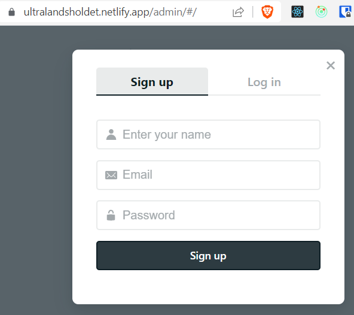

# Ultralandsholdetets public web

[](https://app.netlify.com/sites/ultralandsholdet/deploys)

### Links

* [Original README](README.org.md)
* Netlify CMS
    * Starter template: 
        * [gatsby-starter-netlify-cms](https://www.gatsbyjs.com/starters/netlify-templates/gatsby-starter-netlify-cms/)
        * [Demo site](https://techhub.p-m.si/)
    * [Docs](https://v1.netlifycms.org/docs/start-with-a-template/)
    * Article: [Netlify CMS to Become Decap CMS: What You Need to Know](https://www.netlify.com/blog/netlify-cms-to-become-decap-cms/)
* [Netlify CLI](https://github.com/netlify/cli)

### Udvikler detaljer

```bash
# Create web from template
gatsby new ultralandsholdet https://github.com/netlify-templates/gatsby-starter-netlify-cms

# You need netlify to run
npm install netlify-cli -g
ntl -v
# netlify-cli/13.1.6 win32-x64 node-v18.15.0

# run locally
cd ultralandsholdet
gatsby develop

# or start it with netlify development server
netlify dev
# or ntl dev
```

#### Deployment

The site is hosted at Netlify.  
  
You need to [signup](https://app.netlify.com/)

You can then connect a git(hub) repo to Netlify and rename the url on the [settings](https://app.netlify.com/sites/ultralandsholdet/settings/general) page.  

This site deployes to [https://ultralandsholdet.netlify.app/](https://ultralandsholdet.netlify.app/) on push to git.  

It uses Netlify Identify for its CMS authentication. 
 
1. st you [enable it](https://docs.netlify.com/visitor-access/identity/#enable-identity-in-the-ui) in the [settings page](https://app.netlify.com/sites/ultralandsholdet/settings/identity).  
2. nd you enable [git gateway](https://app.netlify.com/sites/ultralandsholdet/settings/identity#git-gateway).  
3. rd you browse to the [sites admin](https://ultralandsholdet.netlify.app/admin/#/) page.  
There you signup and go to your email for confirm.  
  
4. th you change registration to [Invite Only](https://app.netlify.com/sites/ultralandsholdet/settings/identity#registration).  
5. th you [send out invitations](https://app.netlify.com/sites/ultralandsholdet/identity)  

If you get `Your Git Gateway backend is not returning valid settings`, then read [more here](https://decapcms.org/docs/add-to-your-site/#backend). You probably missed bullet 2.

Deploy links:

* Netlify CMS [access](https://v1.netlifycms.org/docs/start-with-a-template/)
* Gatsby docs: [HowTo deploy](https://www.gatsbyjs.com/docs/how-to/previews-deploys-hosting/deploying-to-netlify/)
* Netlify 
    * [Deploy Guide](https://www.netlify.com/blog/2016/10/27/a-step-by-step-guide-deploying-a-static-site-or-single-page-app/)
    * Docs: 
        * [Deploy](https://docs.netlify.com/get-started/#deploy-a-project-to-netlify)
        * [Gatsby build plugins](https://docs.netlify.com/integrations/frameworks/gatsby/#essential-gatsby-build-plugin)
    * Quick Setup via [https://app.netlify.com/start/deploy?repository=https://github.com/ultralandsholdet/web](https://app.netlify.com/start/deploy?repository=https://github.com/ultralandsholdet/web)

#### Issues

##### Field “image” must not have a selection since type “String” has no subfields

The issue can be resolved with a plugin

```bash
npm install --save gatsby-plugin-netlify-cms-paths
```

And add it to `gatsby-config.js`

```js
    "gatsby-transformer-sharp",
    {
      resolve: `gatsby-plugin-netlify-cms-paths`,
      options: {
        // Path to your Netlify CMS config file
        cmsConfig: `/static/admin/config.yml`
      }
    },
    {
      resolve: "gatsby-transformer-remark",
    }
```

Links

* https://stackoverflow.com/a/62748706/750989
* https://www.gatsbyjs.com/plugins/gatsby-plugin-netlify-cms-paths/
* https://www.gatsbyjs.com/docs/how-to/local-development/troubleshooting-common-errors/#field-image-must-not-have-a-selection-since-type-string-has-no-subfields

.
