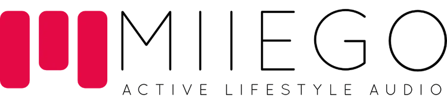
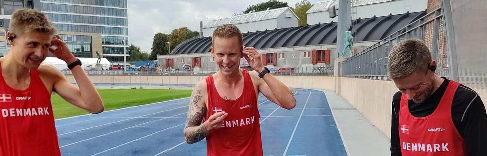
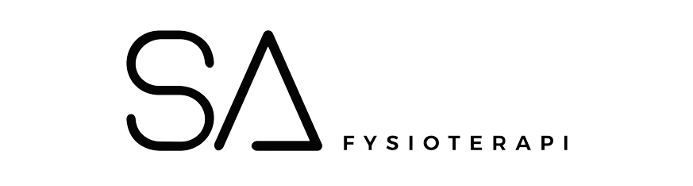

---
### Audiopartner

<h3></h3>
I samarbejdet mellem MIIEGO og Ultralandsholdet, er der én unik faktor, der binder det hele sammen. De funktionelle høretelefoner.  
Hos MIIEGO arbejder de hver dag for at skabe gode funktionelle produkter, som kan tåle at blive brugt. Deres trådløse lydprodukter er netop bygget til de lange løbeture – både i tør- og regnvejr.  
<h3></h3>

<h3></h3>

---
### Fysio partner

<h3></h3>
I samarbejdet mellem SA Fysioterapi og Ultralandsholdet vil der lægges vægt på de skadesforebyggende og præstationsfremmende elementer.  
Dette indebærer: Screening og test af bevægeapparatet, gennemgang af skadeshistorik/træningsdosering/load management, samt løbende behandling af skader og efterfølgende sparring.  
<h3></h3>

---
