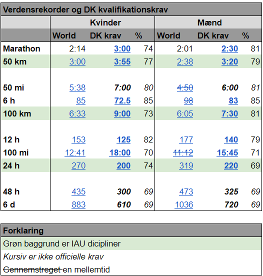

###

##
## Gør som Wozniacki - kom til VM på et wildcard

Wozniacki er på vej tilbage til tennis på et **wildcard**.  
  
_Foto: Wikipedia_

Som noget nyt i 2023 har ultralandsholdet åbnet for **ansøgning til ultralandsholdet** og dets stævner.

I 2023 rejser landsholdet til to stævner

* [VM 50 km](https://iau-ultramarathon.org/2023-iau-50km-world-championships-announcement.html) i Hyderabad i Indien d. 5 november
* [VM 24 timer](https://iau-ultramarathon.org/2023-iau-24hr-world-championship-announcement.html) i Taipei i Taiwan d. 2 december

Løbere har mulighed for at få en **wildcard** plads. Det vil sige at vi kan sende folk til mesterskab, som endnu ikke har kvalificeret sig.

Det giver også mulighed for at atleter fra andre sportsgrene kan søge ind, som for eksempel Triathlon.

Folk, inklusiv landsholdsløbere, der endnu ikke er [forhåndsudtagne](https://bit.ly/ul-fu), skal **ansøge om optagelse**.

##
## Kvalifikationskrav

Kan du allerede klare kvalifikationskarvane kan du komme direkte på landsholdet. Det sikrer dig dog ikke en plads til VM. 

For at komme med til VM i 2023 skal du  udvælges. Der udvælges både blandt kvalificerede og folk, 
* som ikke helt er der eller 
* som vil have comeback eller
* som kommer fra andre sportsgrene. 
De kan få en **wildcard** plads.

For at få en **wildcard** plads rækker det med op til 20% ringere resultat eller at du på anden måde kan vise at du har talent.  
Så **søg** endelig, hvis du har ambitioner. Du har alt at vinde og intet at tabe.  

####  
**Ansøgningsformular** for 2023 finder du [her](https://forms.gle/hQN81PJ3EXc1LzKZ8)

Kom frisk - **ansøg** og se om du får en plads.

##
## Tidsfrister

I tabellen under er **ansøgningsfrist** for

* VM 50 km: **25 juli 2023**
* VM 24 timer: **22 august 2023**

Løbere på landsholdet skal overholde gældende [doping regler](https://www.antidoping.dk/)

##
## Hvem gør hvad

* Løber:
    * Ansøger om deltagelse i stævner og optagelse på landsholdet
    * Afventer udvælgelse fra landsholdet
    * Ansøger om visa
    * Eventuelt får vaccinations boosts
    * Betaler hotelophold/stævne til landsholdet
    * Køber rejse til stævne
    * Betaler mad og drikke på rejsen
* Landsholdet:
    * Tilmelder hold til stævner
    * Slutafregner med DAF og løberne - inclusiv tilbagebetaling af travelgrants til løberne

##
## Åbne løb

Skulle en løber ikke blive accepteret på landsholdet har stævner ofte åbne løb, som løberen kan deltage i:

* [24 timers åben](https://docs.google.com/document/d/1pzMD8B4cDRejvNOZ8HikUmYTkNKwwf3jKuJu7_LqQZQ/edit). Brug google translate til oversættelse.
* 50 km åben: Vides ikke (her i slut juni)

På landsholdet vil vi gøre så meget som muligt for at inkludere danske løbere fra åbne løb i landsholdteamet, så de kan bidrage til en samlet dansk teamånd. 
Der er dog begrænsninger bl.a. i form af at depot for åbent løb ikke er delt med landsholdet.

Tilmelding og arrangering af deltagelse i åbne løb gøres af løberen selv.

_Denne side er publiceret primo Juli 2023_
