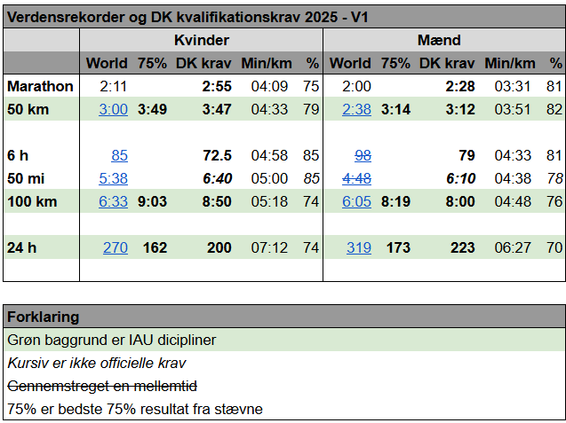
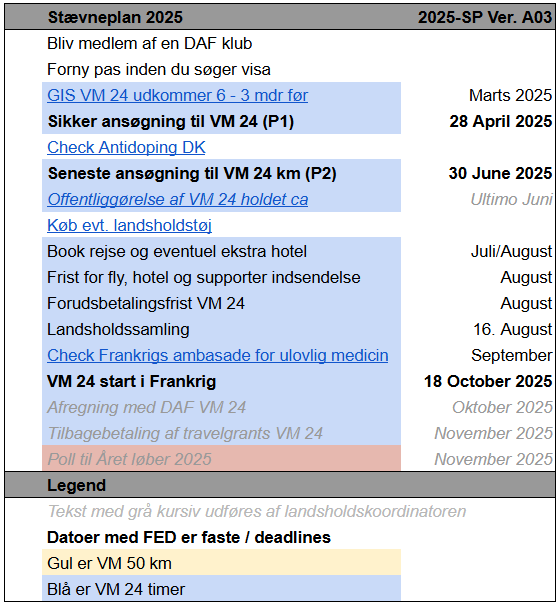
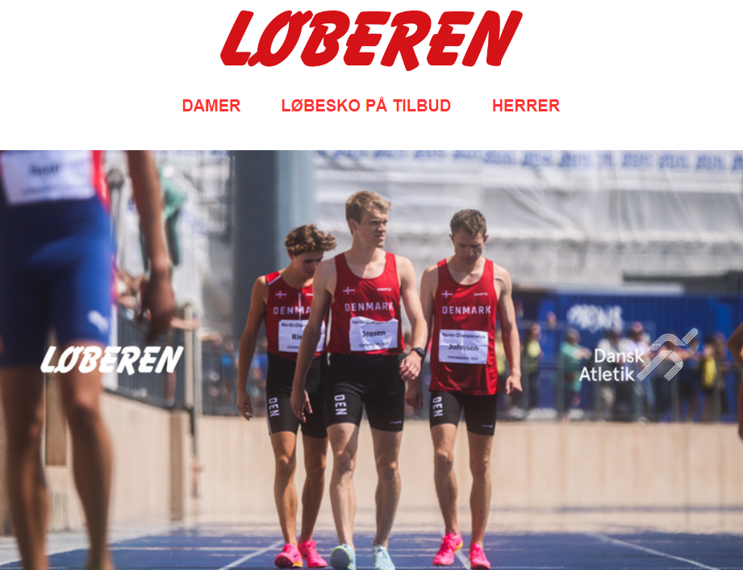

###

##
## Kom landsholdet til VM 🌍 på et wildcard

Ligesom i 2024 har ultralandsholdet åbnet for **ansøgning til ultralandsholdets stævner**.

I 2025 rejser landsholdet til et stævne

* **[VM 24 timer](https://iau-ultramarathon.org/2025-iau-24-hour-world-championship-announcement.html) i Albi i Frankrig 🇫🇷 d. 18 oktober**.  

Løbere har mulighed for at få en **wildcard** plads. Det vil sige at vi kan sende folk til mesterskab, som endnu ikke har kvalificeret sig.

Det giver også mulighed for at atleter fra andre sportsgrene kan søge ind, som for eksempel Triathlon.

Alle løbere, inklusiv landsholdsløbere, skal **ansøge om optagelse**.

####  **Ansøgningsformular** for 2025 finder du **[her](https://forms.gle/hBEDXsF1hKWVN14q7)**

##
## Kvalifikationskrav

Kan du allerede klare kvalifikationskravene er du 95% sikret en plads til VM. 

For at komme med til VM i 2025 skal du udtages. Der udtages både blandt kvalificerede og folk, 
* som ikke fik løbet et kvalificerende løb eller 
* som vil have comeback eller
* som kommer fra andre sportsgrene. 
De kan få en **wildcard** plads.

For at få en **wildcard** plads skal man kunne påvise at man har et niveau tilsvarende kvalifikationskravene.  

  
 

#### Ændrede kvalifikationskrav for 2025  

* 100 km krav skærpedes fordi PR af de deltagende ved VM i 2024 er øget  
* 24 timers kvalifikation kan ikke opnås med 12 timer og 100 miles resultater  

##
## Tidsfrister

Der er to perioder at søge i ⏰
* P1: Indtil den **28. april 2025** 🟢. Herefter laves forhåndsudtagelse (eksklusiv wildcards).
* P2: Indtil den **30. juni 2025** 🟠. Herefter laves endelig udtagelse (inklusiv wildcards).

Kvalificerer du dig i P1, er du 95% sikker på en plads på holdet 😊.  
Søger du i P2, er der chance for, at GIS *1 udkommer i løbet af perioden, og at der bliver risiko for at der lukkes for ansøgning ☹️ før P2 udløber💡  
Søg derfor helst kun i P2 hvis du glemte at søge i P1 eller forbedrer dig i P2.

*1 GIS er invitation inkl. tilmelding fra IAU til landsholdene. Den indeholder deadlines, som bestemmer landsholdets deadlines.

Løbere på landsholdet skal overholde gældende [doping regler](https://www.antidoping.dk/)

##
## Hvem gør hvad

* VM Løber:
    * Bliver medlem af en DAF-klub
    * Ansøger om deltagelse i stævner
    * Afventer udtagelse fra landsholdet
    * Fornyer pas, hvis nødvendigt
    * Ansøger om visa (når påkrævet)
    * Får eventuelt vaccinations boosts
    * Betaler hotelophold/stævne til landsholdet
    * Køber rejse til stævne
* Landsholdet:
    * Tilmelder hold til stævne(r)
    * Slutafregner med DAF og løberne - inklusiv tilbagebetaling af travelgrants til løberne

##
## Åbent løb

Skulle en løber ikke blive accepteret på landsholdet har stævner ofte åbne løb, som løberen kan deltage i:

* [24 timer åben](https://www.albi24h.fr/)

På landsholdet vil vi gøre så meget som muligt for at inkludere danske løbere fra åbne løb i landsholdteamet, så i kan bidrage til en samlet dansk teamånd. 
Der er dog begrænsninger bl.a. i form af at depot for åbent løb ikke er delt med landsholdet.
Ønsker i at deltage i åbent løb er i også velkomne i vores stævnegruppe og til at deltage i landsholdssamling.  
Som sidste søger vi en `Kaptajn for 24 timer åbent løb og WMA`, som er bindeled til landsholdet. Det er en frivillig ubetalt opgave for at fremme den danske teamånd.  

Tilmelding og arrangering af deltagelse i åbne løb gøres af løberen selv.

Bemærk: 
* Løbere i det åbne løb er ikke en del af VM og der er ingen travelgrants udbetalt til dem
* Løbere i det åbne løb tilmelder sig selv til det åbne løb
* Løbere i det ånbe løb tilskyndes at også at sende en ansøgning til landsholdet

### Ultra Masters og WMA mesterskab

Er man tilmeldt stævne enten som udtaget til Ultralandsholdet eller via det åbne løb har man også mulighed for at deltage i **[WMA](https://world-masters-athletics.org/championships/)** mesterskab - aldersklasse verdensmesterskabet.  

* 24 timer WMA: Link til ansøgning kendes endnu ikke (her i midt februar)

Alle i det åbne løb er velkomne til også at deltage i WMA, hvis i er gamle nok (35+).

På ultralandsholdet har vi derfor lavet samarbejde med **[Masters Atletik](https://www.facebook.com/groups/399591766775129)**.  

Det betyder at du kan bruge deres Facebook side til at finde ligesindede, stille spørgsmål om at deltage i mesterskaber og købe masters tøj.  
Du har også mulighed for at købe landsholdstøj - også selvom du løber i det åbne løb - se nederste afsnit her på siden.  

Endnu er ultra relativt nyt for Masters Atletik.  
Derfor er du også velkommen til at kontakte os.  
Har du brug for at kende danske `ultra masters rekorder`, så finder du dem **[her](https://statistik.d-u-v.org/getintbestlist.php?year=all&dist=24h&gender=M&cat=all&nat=DEN&label=&hili=none&tt=netto&Submit.x=5&Submit.y=6)**.  
_Vælg aldersklasse i listen og tryk Go_

Du er velkommen til at deltage i **WMA** mesterskabet, hvis ellers du kan klare de krav arrangøren sætter til det åbne løb.  

Bliver interessen stor får vi måske brug for et **UltraMastersLandshold**.  

Bemærk: 
* Løbere i det åbne løb er ikke en del af VM og der er ingen travelgrants udbetalt til dem
* Løbere i det åbne løb kan nøjes med at tilmelde sig det åbne løb og behøver ikke at tilmelde sig WMA
* Løbere i WMA skal enten være udtaget til ultralandsholdet eller være tilmeldt det åbne løb
* Ønsker du også at løbe WMA skal du tilmelde dig WMA. Det koster ca. dkr 750 ekstra. Du tilmelder selv dig til WMA.
* Løbere i WMA skal godkendes af DAF, så det kræver at du er [medlem af en DAF klub](https://connect.atletik.dk/Clubs) og at du enten fortæller i ansøgning til UltraLandsholdet/WMA at du måske vil løbe i WMA.  
Alternativt kontakter du DAF direkte ([Inger Marie](https://dansk-atletik.dk/forbundet/kontakt-daf/#stabsfunktioner)), så du kan blive godkendt.

##
<h2 id="landsholdssamling">Landsholdssamling</h2>

Før VM arrangerer landsholdet en samling i DK, så Landsholdsdeltagere, WMA og åbentløbsdeltagere har mulighed for at bygge en landsholdsånd op forud for VM.
Invitation sendes ud til løbere, der har søgt om deltagelse.
I år løber samlingen af stablen **d. 16 August**.

##
<h2 id="landsholdstoj">Landsholdstøj</h2>

[DAF](https://dansk-atletik.dk/nyheder/2024/05/bliv-godt-klaedt-paa-med-dafs-kollektion-hos-loeberen/) har gjort det muligt at købe sig eget landsholdstøj ved at lave en aftale med [Løberen](https://www.loberen.dk/daf).

Bemærk:
* Til VM er det ikke et krav at anskaffe sig sit eget landsholdstøj. Landsholdet udlåner det tøj, som løberne ikke selv tager med.
* Løberen har ofte udsolgt af officielt løbe tøj, så der gælder ovenstående udlån.
* Landholdet udlåner ikke til Åbentløbs løbere (som så må være selvforsynende).
* Købt Landsholdstøj skal være købt hos Løberen.
* Der må ikke være ekstra tryk på landsholdstøj, så som navn eller logo.

_Denne side er publiceret medio Februar 2025_
